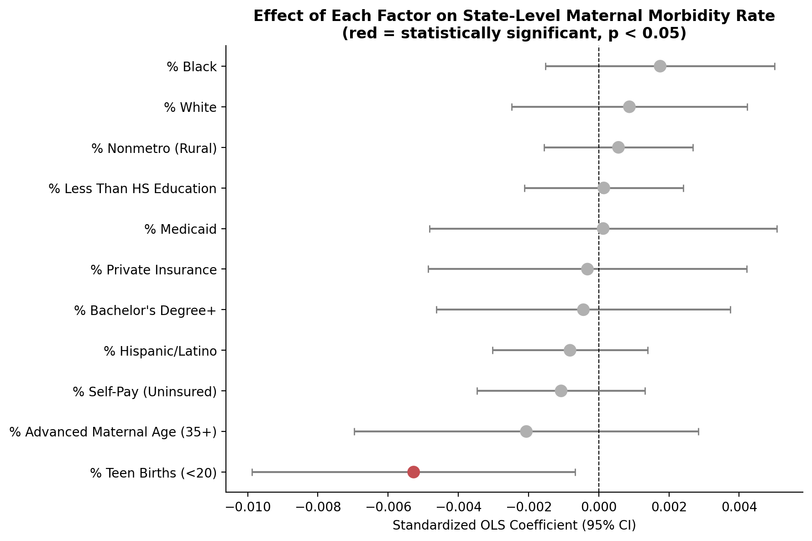
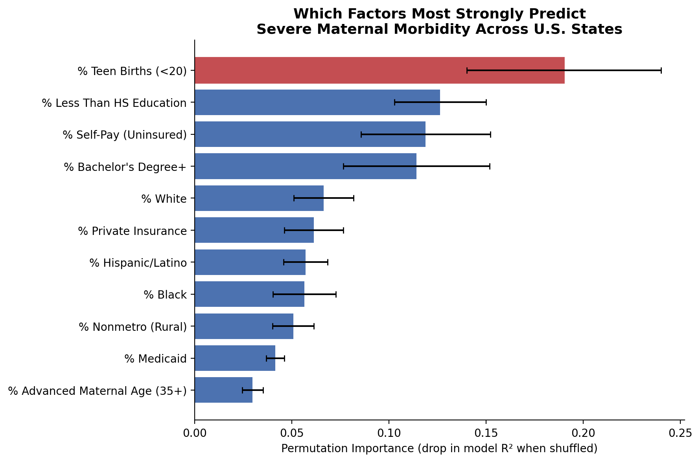
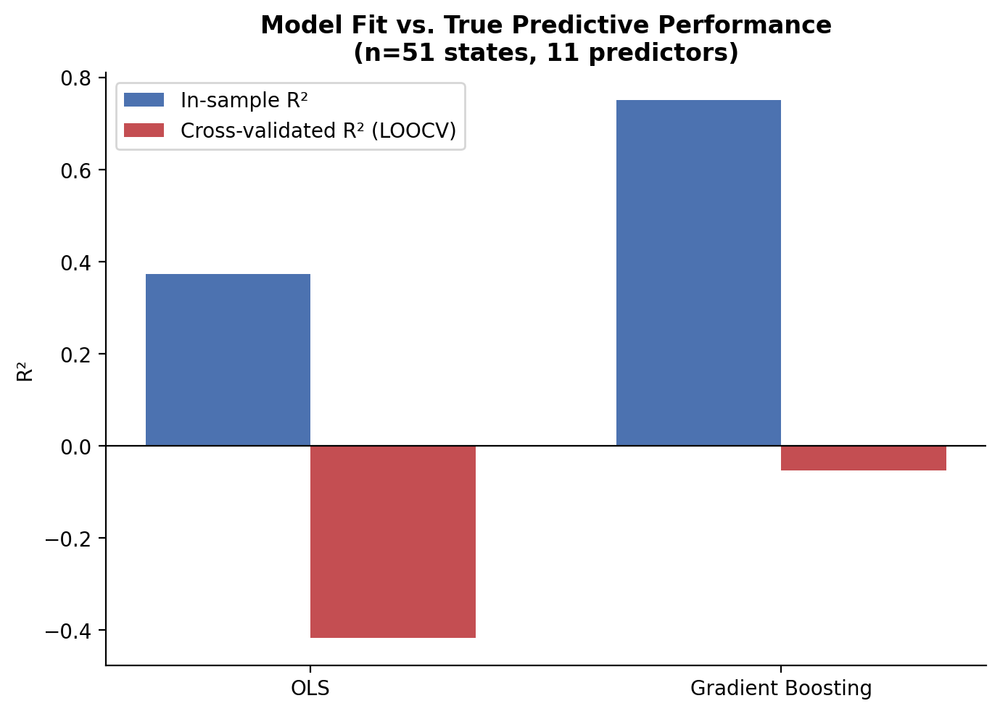
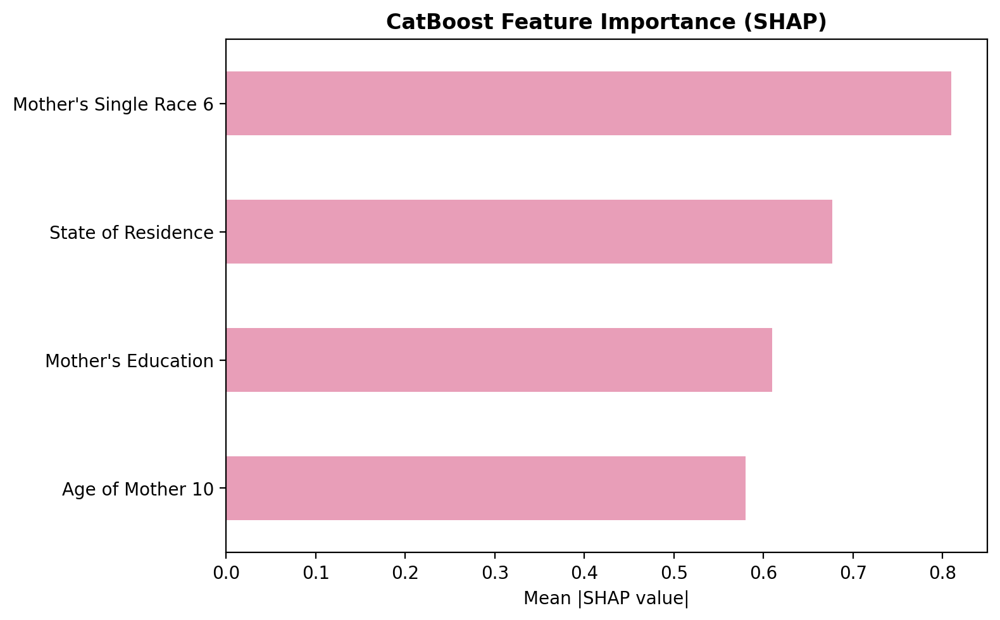
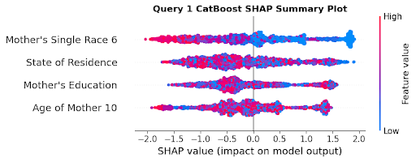
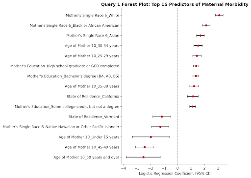
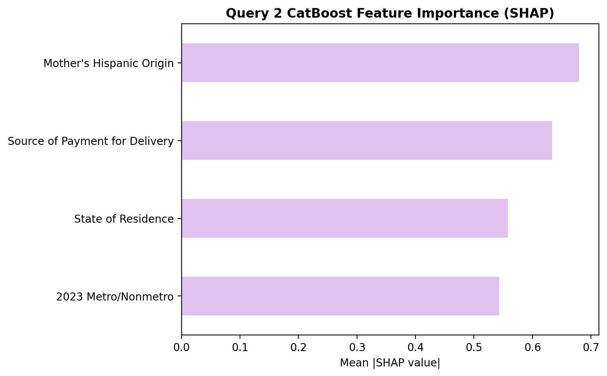
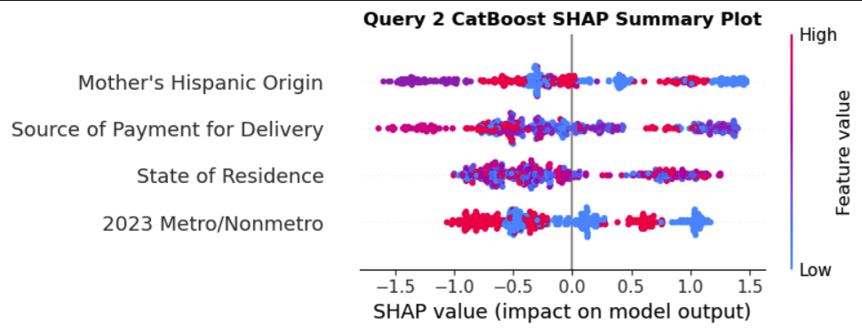
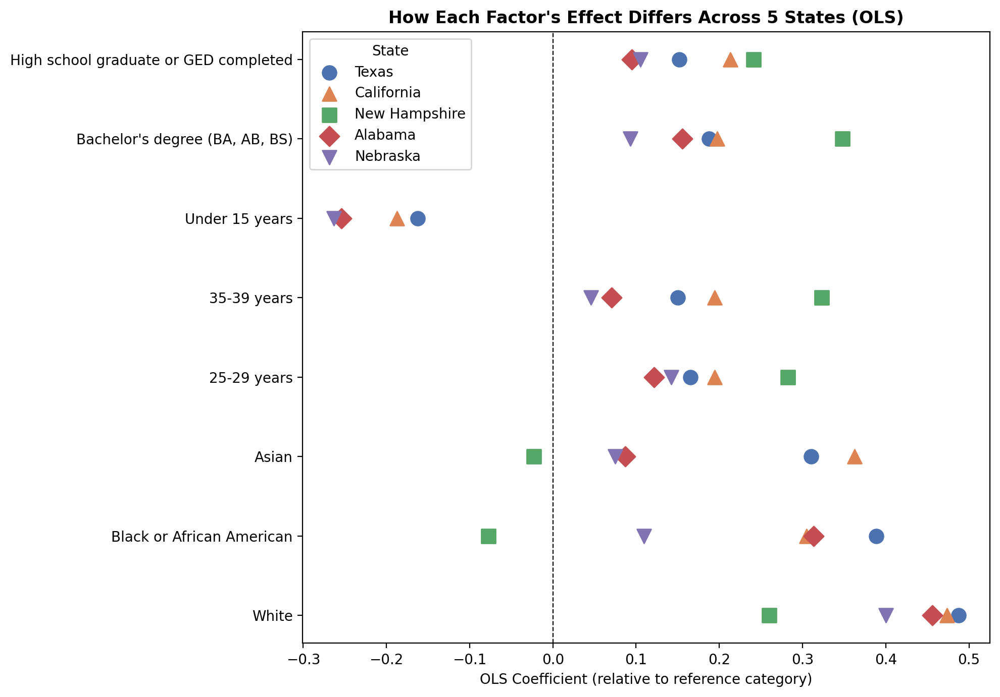
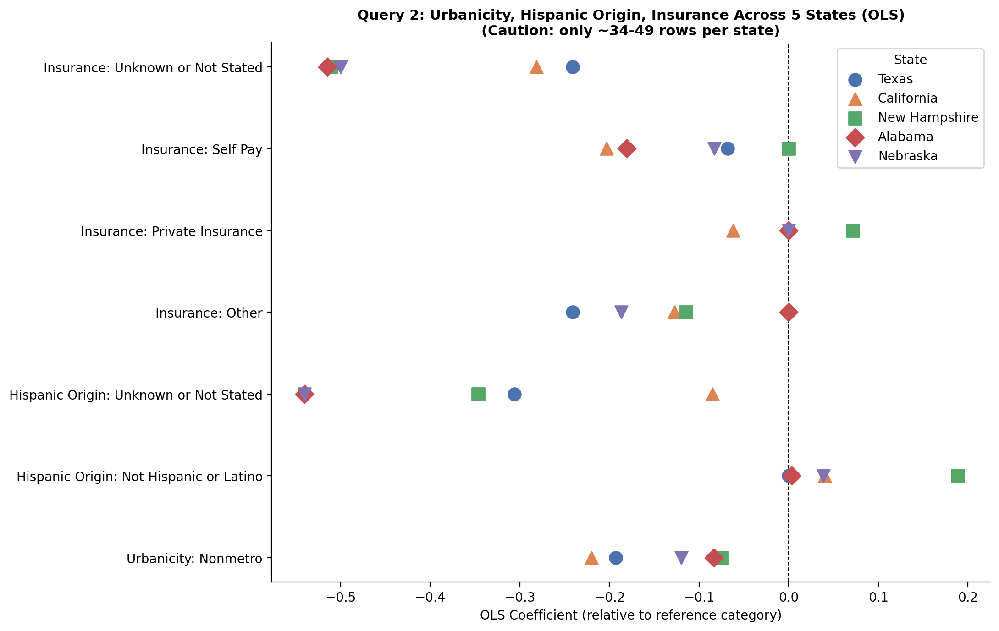

# Which Social Determinants Best Predict Maternal Morbidity in the United States?

Comparing OLS, gradient boosting, logistic regression, and CatBoost across two analytical scales, using CDC WONDER natality data (2023 – mid-2026).

**Melissa Ballesteros** · QSS 45, Dartmouth College 

---

## Summary

The United States spends more per capita on healthcare than any other high-income country, yet has an overall maternal mortality rate of 18.6 per 100,000 live births — and 50.3 per 100,000 among Black women. This project asks which *social determinants of health* best predict maternal morbidity, and whether their relative importance changes depending on the scale at which the data are analyzed.

**The headline finding: there is no single dominant social determinant.** The "most important" predictor changes with the level of analysis and the modeling approach:

| Analysis | Model | Top predictor |
|---|---|---|
| State level (n = 51) | OLS | Teen birth rate (β = −0.0053, *p* = 0.03) — the only significant predictor |
| State level (n = 51) | Gradient boosting | Less than high school education (0.211), then self-pay (0.126) |
| Query 1 (n = 14,561) | CatBoost / SHAP | Mother's race, then state of residence, education, age |
| Query 2 (n = 1,939) | CatBoost / SHAP | Mother's Hispanic origin, then source of payment, state, urbanicity |

Both state-level models produced **negative cross-validated R²** — worse than predicting the mean — so the state-level results are reported as descriptive, not predictive. The granular models generalized considerably better (Query 1 logistic AUC = 0.817; CatBoost AUC ≈ 0.99).

---

## Research question

> Which social determinants best predict maternal morbidity in the United States, and does their relative importance change depending on the level of analysis?

Two theoretical frameworks motivate competing expectations:

- **[Weathering Hypothesis](https://www.jstor.org/stable/45403051)** (Geronimus, 1992) — chronic exposure to racialized stressors accelerates physiological decline, so *race should stay important even after controlling for socioeconomic factors*.
- **[Fundamental Cause Theory](https://doi.org/10.2307/2626958)** (Link & Phelan, 1995) — socioeconomic status supplies flexible resources that can be redeployed against whatever health risk is currently most threatening, so *education and insurance should dominate*.

The results give **partial support to both**, and support for each depends on which scale you look at — which is itself the paper's central point.

---

## Data

Source: **[CDC WONDER Natality Database](https://wonder.cdc.gov/natality.html)**, births from 2023 through mid-2026. All records are publicly available, de-identified aggregate counts.

CDC WONDER caps each query at five grouping variables, so the data were pulled in two queries:

| | Grouping variables | Rows |
|---|---|---|
| **Query 1** | State × Race (6) × Age of Mother (10) × Education × Morbidity Checked | 14,561 |
| **Query 2** | State × Metro/Nonmetro × Hispanic Origin × Source of Payment × Morbidity Checked | 1,939 |

**Dependent variable — `Maternal Morbidity Checked`:** an indicator that the birth certificate recorded at least one of five severe complications: ICU admission, transfusion, perineal laceration, unplanned hysterectomy, or uterine rupture.

> [!IMPORTANT]
> This is a **documentation-based** measure, not a direct clinical measurement. It reflects whether a complication was *recorded on the birth certificate*, so differences across states and hospitals may partly reflect documentation and reporting practice rather than underlying risk. Every result below should be read with that caveat in mind.

Both queries were also collapsed to the state level and merged into a 51-row dataset (50 states + D.C.) with 11 composite predictors covering race, ethnicity, age, education, payment source, and urbanicity.

---

## Repository structure

```
├── notebooks/
│   ├── 01_main_analysis.ipynb              # State-level OLS + gradient boosting;
│   │                                       # Query 1 & 2 logistic regression + CatBoost/SHAP
│   └── 02_state_stratified_analysis.ipynb  # Five-state comparison (CA, NH, AL, NE, TX)
├── data/
│   ├── raw/          # Unmodified CDC WONDER query exports
│   ├── processed/    # Cleaned per-state extracts and merged five-state file
│   └── results/      # Model output: logistic and per-state OLS coefficient tables
├── figures/          # Figures 1–11 as they appear in the paper
├── paper/            # Full write-up (PDF)
└── requirements.txt
```

---

## Results

### 1. The predictors are highly interconnected

Several determinants correlate with maternal morbidity individually, but also with each other — teen birth rate and bachelor's-degree attainment are strongly inversely related, for instance. This is why single-variable correlations overstate the case.

| Predictor | Correlation | *p* |
|---|---:|---:|
| Teen birth rate | −0.4842 | 0.0003 |
| Bachelor's degree attainment | 0.4296 | 0.0017 |
| Private insurance | 0.3954 | 0.0041 |
| Less than high school | −0.3808 | 0.0058 |
| Medicaid | −0.2911 | 0.0382 |
| Advanced age | 0.2719 | 0.0536 |
| Self-pay | −0.2623 | 0.0629 |
| Hispanic | −0.2570 | 0.0687 |
| White | 0.1070 | 0.4550 |
| Black | −0.0727 | 0.6123 |
| Nonmetro | 0.0186 | 0.8969 |

### 2. In OLS, only teen birth rate survives



*Figure 1 — Standardized OLS coefficients with 95% CIs. The red marker is the only significant predictor (p < 0.05).*

Five predictors are significant on their own; once all 11 enter the model together, only teen birth rate remains (β = −0.0053, *p* = 0.03). The negative sign is counterintuitive and is a **state-level** association — it does not mean individual teenagers face lower risk.

### 3. Machine learning ranks the predictors differently



*Figure 2 — Permutation importance from the gradient boosting model (drop in R² when each predictor is shuffled).*

Gradient boosting put **less than high school education** first (0.211), then **self-pay** (0.126), then teen birth rate (0.096). This is the paper's cleanest illustration that *statistical significance and predictive importance are different things*: a variable can drive predictions without being significant in OLS, and vice versa.

### 4. …but both state-level models overfit



*Figure 3 — In-sample versus leave-one-out cross-validated R² (n = 51 states, 11 predictors).*

| Model | In-sample R² | LOOCV R² |
|---|---:|---:|
| OLS | 0.373 | **−0.418** |
| Gradient boosting | 0.752 | **−0.054** |

Gradient boosting looks far stronger in-sample and is *worse than the mean* out-of-sample. With 51 observations and 11 predictors, both models were fitting state-specific noise. This motivated moving to the granular data.

### 5. At the granular level, race leads in Query 1

<p align="center">
  
  
</p>

*Figures 4 & 5 — Query 1 CatBoost feature importance (mean |SHAP|) and the SHAP summary plot across 14,561 records.*

Across 14,561 demographic combinations, **mother's race** was the most influential feature, followed by state of residence, education, and age. The beeswarm shows race with by far the widest spread of SHAP values. Query 1 also predicted well: logistic AUC = 0.817, CatBoost AUC ≈ 0.99.



*Figure 6 — Query 1 logistic regression coefficients, 15 strongest predictors, with 95% CIs.*

> [!NOTE]
> Births in the White category showed the highest predicted probability of *documented* morbidity relative to the reference group. Given the documentation caveat above, this is a statistical and predictive relationship — not evidence that race biologically causes maternal morbidity.

### 6. In Query 2, Hispanic origin leads — with a weaker signal

<p align="center">
  
  
</p>

*Figures 7 & 8 — Query 2 CatBoost feature importance and SHAP summary plot.*

**Mother's Hispanic origin** ranked first, then source of payment, state, and urbanicity. Query 2 carried less information overall (logistic AUC = 0.659 vs 0.817), though still above the 0.50 chance level; CatBoost reached 0.977.



*Figure 9 — Query 2 logistic regression coefficients with 95% CIs (state dummies estimated but omitted for readability).*

Because the two queries were modeled separately, race leading in Query 1 and Hispanic origin leading in Query 2 **does not** establish that either is universally the stronger predictor.

> Since these predictors are categorical, the SHAP color scale encodes category *labels*, not a meaningful high/low ordering. Read magnitude and direction, not color gradient.

### 7. Effects vary across states

<p align="center">
  
  
</p>

*Figures 10 & 11 — State-specific OLS coefficients for the Query 1 and Query 2 predictors.*

Five states spanning different regions — California, New Hampshire, Alabama, Nebraska, Texas — were modeled separately. Documented morbidity rates differ across them (New Hampshire highest of the five), and some determinants hold a consistent direction across states while others vary substantially. The point is not to rank states, but to show that maternal morbidity is not distributed uniformly.

> [!WARNING]
> The Query 2 per-state estimates rest on roughly 34–49 rows per state and should be interpreted with caution.

---

## Reproducing the analysis

```bash
git clone https://github.com/melissabllstrs12/maternal-morbidity-sdoh.git
cd maternal-morbidity-sdoh
python -m venv .venv && source .venv/bin/activate   # Windows: .venv\Scripts\activate
pip install -r requirements.txt
jupyter lab
```

Run `notebooks/01_main_analysis.ipynb` first, then `notebooks/02_state_stratified_analysis.ipynb`. Notebook paths are relative to the `notebooks/` directory, so run them from there. CatBoost writes a `catboost_info/` training log, which is gitignored.

---

## Limitations

- **Small state-level sample.** 51 observations against 11 predictors; both state-level models overfit badly (negative cross-validated R²).
- **Multicollinearity.** Many social determinants overlap, making it hard to isolate any one independent effect.
- **Omitted variables.** Poverty rate, median household income, and healthcare workforce shortages are absent. Education and insurance stand in as proxies for socioeconomic conditions but do not fully capture income or access.
- **Documentation-dependent outcome.** "Morbidity Checked" reflects recording practice as well as underlying risk.

**Future work:** reduce collinear predictors or use methods designed for multicollinearity; add income, poverty, and workforce-shortage measures; and move to clinically measured morbidity rather than a birth-certificate indicator.

---

## Conclusion

Maternal morbidity is best understood as the product of **interconnected social conditions**, not one isolated determinant. Because relative importance shifted across analytical scale, modeling approach, and state context, interventions likely need to be tailored to specific populations and places rather than organized around a single universal "top factor."

---

## References

1. Geronimus, A. T. (1992). The Weathering Hypothesis and the Health of African-American Women and Infants: Evidence and Speculations. *Ethnicity & Disease*, 2(3), 207–221. <http://www.jstor.org/stable/45403051>
2. Link, B. G., & Phelan, J. (1995). Social Conditions as Fundamental Causes of Disease. *Journal of Health and Social Behavior*, 35, 80–94. <https://doi.org/10.2307/2626958>
3. Gunja, M. Z., Gumas, E. D., & Williams II, R. D. (2026). U.S. Health Care from a Global Perspective, 2026: Expanded Edition. *The Commonwealth Fund*. <https://doi.org/10.26099/2egm-8b76>

## License

Code released under the [MIT License](LICENSE). Underlying natality data are public-domain CDC WONDER exports, subject to the [CDC WONDER data use restrictions](https://wonder.cdc.gov/datause.html).
